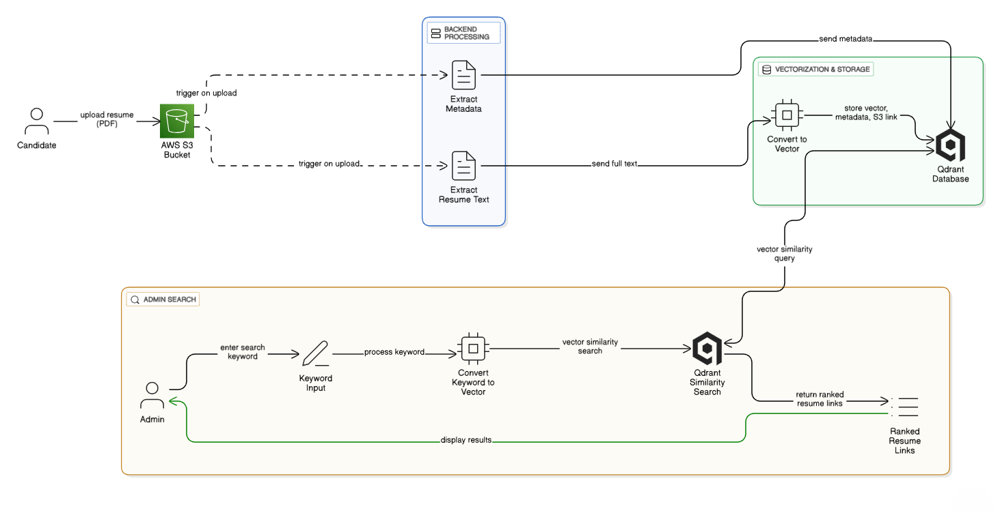

# Resume Search Application

**Version:** 1.0  
**Author:** Team 1  
**Date:** October 07, 2025  

A full-stack web platform for intelligent resume management and semantic search, built for enterprise-level HR operations.

---

## 🚀 Project Overview

The Resume Search Application automates resume ingestion, extraction, vectorization, and semantic search. It supports PDF and DOCX uploads, stores files in AWS S3, and uses Qdrant for vector-based retrieval. Admins can search using natural language queries, with results ranked by relevance.

## Key Features

- **Resume Upload**: Secure upload interface for candidates with PDF/DOCX support and real-time processing feedback.
- **Semantic Search**: Natural language or keyword-based searches with vector similarity ranking for precise results.
- **Document Processing**: Automated text and metadata extraction using PyMuPDF and python-docx.
- **Embeddings and Storage**: Generation of vector embeddings via sentence-transformers, stored in Qdrant with links to AWS S3 files.
- **Admin Tools**: Interfaces for viewing all resumes, analytics, settings, and retrieval.

## Target Users

- **Candidates**: Upload resumes easily through the web interface.
- **Recruiters/Administrators**: Perform advanced searches and view/download resumes.
- **System Administrators**: Monitor application performance and health via Axiom dashboards.

## Technologies and Stack

| Category              | Technologies/Tools                                                                 |
|-----------------------|------------------------------------------------------------------------------------|
| **Frontend**         | React.js (with Vite for build tooling)                                             |
| **Backend**          | Django 5.2.6 with Django REST Framework 3.16.1                                    |
| **Cloud Storage**    | AWS S3 (via boto3 1.40.37 and botocore 1.40.37)                                    |
| **Document Processing** | PyMuPDF 1.26.4 (PDFs), python-docx 1.2.0 (DOCX)                                  |
| **Vectorization & Search** | sentence-transformers 5.1.1, qdrant-client 1.15.1                                |
| **Databases**        | AWS S3 (file storage), Qdrant (vector database)                                     |
| **Environment**      | Python 3.x, Node.js/npm for frontend                                               |

## System Architecture

The system follows an event-driven, modular architecture:

### Data Flows

#### Resume Ingestion Flow
1. Candidate uploads file via React.js to Django API.
2. Django uploads to AWS S3 using boto3.
3. Extraction of text/metadata with PyMuPDF or python-docx.
4. Embedding generation using sentence-transformers.
5. Upsert embeddings and metadata to Qdrant.
6. Logging and monitoring via Axiom.

#### Search Flow
1. Admin submits query via React.js to Django API.
2. Query embedded with sentence-transformers.
3. Similarity search in Qdrant.
4. Ranked results returned to frontend.
5. Performance tracked in Axiom.

## Installation and Setup

### Prerequisites
- Python 3.x
- Node.js and npm
- AWS account (S3 bucket with credentials)
- Qdrant instance (cloud or local)

### Backend (Django)
1. Navigate to the backend directory (e.g., `shared-project/resume`).
2. Create and activate virtual environment: `python -m venv venv` then `source venv/bin/activate` (Unix) or `venv\Scripts\activate` (Windows).
3. Install dependencies: `pip install -r requirements.txt` (or manually install pinned versions as listed).
4. Set environment variables (e.g., AWS keys, Qdrant URL, Axiom API key) in `.env`.
5. Apply migrations: `python manage.py migrate`.
6. Run the server: `python manage.py runserver`.

### Frontend (React.js)
1. Navigate to `frontend`.
2. Install dependencies: `npm install`.
3. Run development server: `npm run dev`.

## Usage

- **Uploading Resumes**: Use the upload page to submit PDF/DOCX files.
- **Searching Resumes**: Enter queries in the search interface; view ranked results with previews.

## Security Considerations

- Django security features (CSRF, XSS protection).
- AWS IAM policies for S3 access.
- JWT for API authentication.
- Encrypted storage in S3.

## Risks and Mitigations

- **Vulnerabilities**: Regular dependency audits and updates.
- **Inaccurate Searches**: Fine-tune embedding models.
- **Scalability**: Implement Celery for async processing and Redis caching.

## Contributing

Fork the repository on GitLab, create a feature branch, and submit a merge request.

